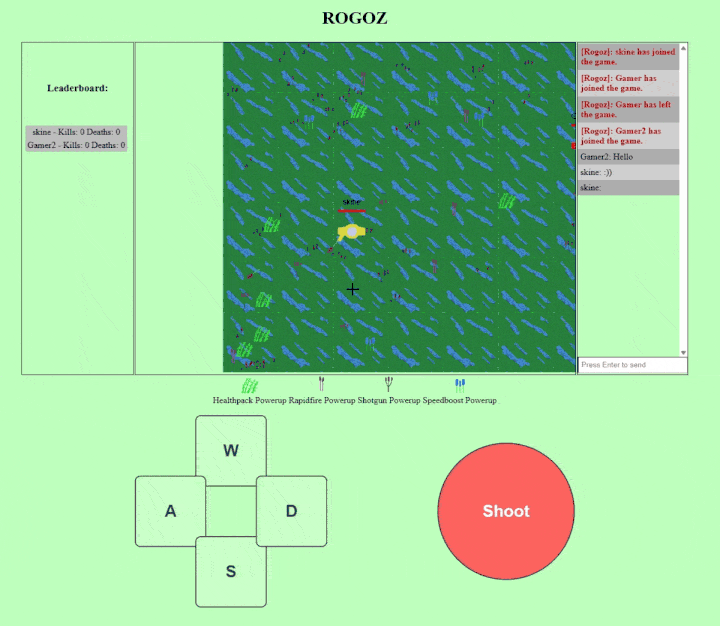
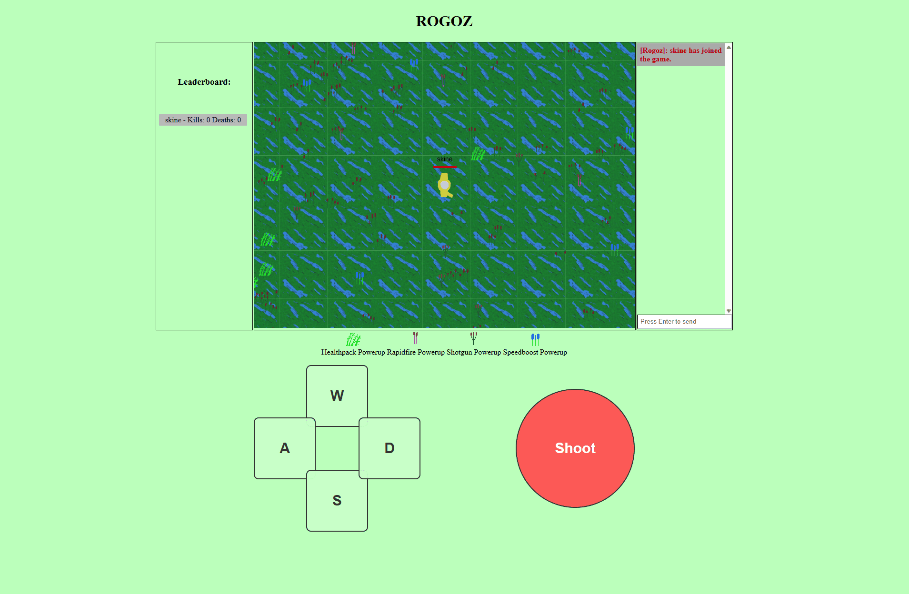
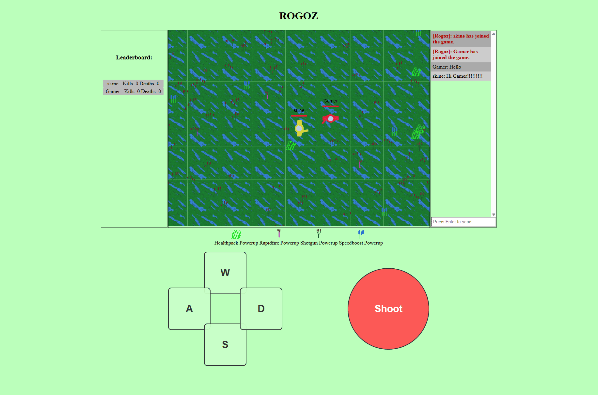

\# Rogoz


An HTML5-based multiplayer 2D action game played in the browser. The application utilizes a client-server architecture with WebSockets.


The objective of the game is to achieve the highest score among all players. Players navigate a swamp environment and can throw cattails at opponents to deal damage. A point is awarded to the player who lands the final hit and knocks out an opponent; the defeated character then respawns at a different location on the map. The game is hosted on my server, and you can test it as well: \[Play](https://kristiank.ee/rogoz)


<div style="overflow-x: auto; padding: 10px 0;">

&#x20; 

</div>

<table>

&#x20; <tr>

&#x20;   <td></td>

&#x20;   <td></td>

&#x20; </tr>

</table>


\## Project Features


\* \*\*Network Communication:\*\* Communication between the client and server takes place via the TCP protocol using WebSockets.

\* \*\*Security and Synchronization:\*\* No calculations are performed on the client side. Keyboard and mouse inputs are sent to the server 60 times per second; the server simulates the geometry and returns object coordinates.

\* \*\*Graphics:\*\* Rendering of the game environment on the client side is implemented using the HTML5 Canvas element.

\* \*\*Power-up System:\*\* Temporary power-ups are randomly generated on the map, offering benefits such as health restoration, increased fire rate, simultaneous multiple-cattail shots (shotgun effect), and increased movement speed.

\* \*\*Social Features:\*\* Includes a leaderboard (sorted by kill count) and a global chat system.

\* \*\*Mobile \& Touch Support:\*\* Responsive UI featuring an on-screen virtual D-Pad and touch-to-aim/shoot mechanics, ensuring seamless gameplay on mobile devices and tablets.


\## Technology Stack


\* \*\*Programming Language:\*\* TypeScript

\* \*\*Server-side:\*\* Node.js

\* \*\*Client-side:\*\* HTML5 (Canvas)

\* \*\*Build Tools:\*\* Gulp


\## System Requirements


\* \*\*Server:\*\* Windows 7 or higher; Node.js version v20.13.1 or higher installed.

\* \*\*Client:\*\* Chromium-based browser with HTML5 support; at least 2 MB of RAM; stable internet connection (minimum 10 Mbps).

\* \*\*Controls:\*\* Keyboard and mouse/trackpad.


\## Installation and Build


1\. Clone the repository and navigate to the project directory.

2\. Install package dependencies:

```bash

npm install

```


3\. Install the Gulp build tool globally:


```bash

npm install --global gulp-cli

```


4\. Compile the project:


```bash

gulp compile

```


\## Running the Application


Use the following command to start the server:


```bash

npm run start

```


By default, the server runs on port `3001`. To change the port, edit the `PORT` constant in the `dist/server.js` file.

To stop the server, press `Ctrl+C` in the command line.


\## In-Game Controls


\* \*\*Movement:\*\* `W`, `A`, `S`, `D` keys.

\* \*\*Attack (throw cattail):\*\* Hold down the left mouse button.

\* \*\*Chat:\*\* Left-click the input field, type your message, and press `Enter` to send.


\## Documentation


For a detailed analysis of the system architecture, including UML sequence diagrams (main game loop, chat synchronization, and leaderboard updates), structural blueprints, and testing methodologies, please refer to the explanatory note (in Russian): `Rogoz\\\_Engineering\\\_Notes\\\_RU.pdf`

